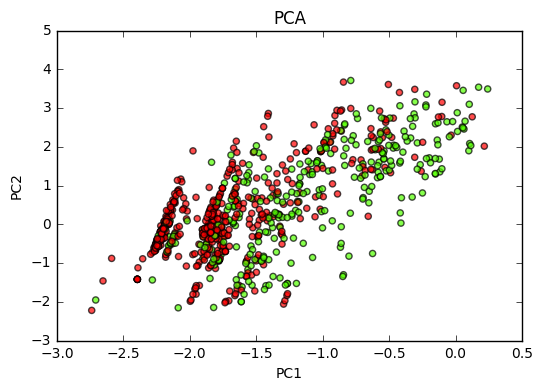

# Predicting Survival on the RMS Titanic Using Logistic Regression
#### Michael T. Letts | lettsmt@gmail.com | Last Updated: December 15th, 2017
<br>
<br>
<br>
#### Foreword
<br>
The below project is unfinished. Numerous assumptions and hypotheses are currently untested, and additional feature engineering and hyperparameter tuning should be employed. In addition, a Principal Components Analysis is arguably inappropriate for 'mixed' data (e.g. continuous and dichotomous) since the assumption of a Gaussian normal distribution is violated, but this project employs a manual implementation of a PCA anyway. Other methods, like Independent Components Analysis, are being explored for viability. In any case, what you see below is what I have currently finished thus far. I hope that you enjoy my work. 
<br>
<br>
#### Sections: 
#### &nbsp;&nbsp;&nbsp;&nbsp;&nbsp;&nbsp;I. Data Processing
#### &nbsp;&nbsp;&nbsp;&nbsp;&nbsp;&nbsp;II. Exploratory Analysis and Dimensionality Reduction
#### &nbsp;&nbsp;&nbsp;&nbsp;&nbsp;&nbsp;III. Prediction 
#### &nbsp;&nbsp;&nbsp;&nbsp;&nbsp;&nbsp;IV. Conclusion
<br>
<br>
#### I. Data Preprocessing
<br>
The title basically says it all-- this section is dedicated to preprocessing the data. More specifically, we will do things like one-hot encode categorical variables, like class or embarked, replace string values with numerical data, impute missing values, et cetera. To begin, let's import our dependencies, set display options, import the data, and inspect the first few rows of data. 


```python
%matplotlib inline
import pandas, numpy 
import matplotlib.pyplot as plt
from sklearn.ensemble import RandomForestClassifier
from sklearn.linear_model import LogisticRegression
from sklearn.preprocessing import StandardScaler
from sklearn.cross_validation import train_test_split
from sklearn.metrics import roc_auc_score, roc_curve, classification_report
pandas.set_option('display.float_format', lambda x: '%.2f' % x)

df=pandas.read_csv('train.csv', index_col='PassengerId')
df.head()
```


<div>
<table border="1" class="dataframe">
  <thead>
    <tr style="text-align: right;">
      <th></th>
      <th>Survived</th>
      <th>Pclass</th>
      <th>Name</th>
      <th>Sex</th>
      <th>Age</th>
      <th>SibSp</th>
      <th>Parch</th>
      <th>Ticket</th>
      <th>Fare</th>
      <th>Cabin</th>
      <th>Embarked</th>
    </tr>
    <tr>
      <th>PassengerId</th>
      <th></th>
      <th></th>
      <th></th>
      <th></th>
      <th></th>
      <th></th>
      <th></th>
      <th></th>
      <th></th>
      <th></th>
      <th></th>
    </tr>
  </thead>
  <tbody>
    <tr>
      <th>1</th>
      <td>0</td>
      <td>3</td>
      <td>Braund, Mr. Owen Harris</td>
      <td>male</td>
      <td>22.00</td>
      <td>1</td>
      <td>0</td>
      <td>A/5 21171</td>
      <td>7.25</td>
      <td>NaN</td>
      <td>S</td>
    </tr>
    <tr>
      <th>2</th>
      <td>1</td>
      <td>1</td>
      <td>Cumings, Mrs. John Bradley (Florence Briggs Th...</td>
      <td>female</td>
      <td>38.00</td>
      <td>1</td>
      <td>0</td>
      <td>PC 17599</td>
      <td>71.28</td>
      <td>C85</td>
      <td>C</td>
    </tr>
    <tr>
      <th>3</th>
      <td>1</td>
      <td>3</td>
      <td>Heikkinen, Miss. Laina</td>
      <td>female</td>
      <td>26.00</td>
      <td>0</td>
      <td>0</td>
      <td>STON/O2. 3101282</td>
      <td>7.92</td>
      <td>NaN</td>
      <td>S</td>
    </tr>
    <tr>
      <th>4</th>
      <td>1</td>
      <td>1</td>
      <td>Futrelle, Mrs. Jacques Heath (Lily May Peel)</td>
      <td>female</td>
      <td>35.00</td>
      <td>1</td>
      <td>0</td>
      <td>113803</td>
      <td>53.10</td>
      <td>C123</td>
      <td>S</td>
    </tr>
    <tr>
      <th>5</th>
      <td>0</td>
      <td>3</td>
      <td>Allen, Mr. William Henry</td>
      <td>male</td>
      <td>35.00</td>
      <td>0</td>
      <td>0</td>
      <td>373450</td>
      <td>8.05</td>
      <td>NaN</td>
      <td>S</td>
    </tr>
  </tbody>
</table>
</div>


Let's go feature by feature, starting with 'Pclass'. We will one-hot encode each class. 


```python
cla=pandas.get_dummies(df.Pclass).astype(int)
df=pandas.concat([df, cla], axis=1, join='inner')
df.drop('Pclass', axis=1, inplace=True)
df.rename(columns={1: 'first_class', 2: 'second_class', 3: 'third_class'}, inplace=True)
df.head(1)
```


<div>
<table border="1" class="dataframe">
  <thead>
    <tr style="text-align: right;">
      <th></th>
      <th>Survived</th>
      <th>Name</th>
      <th>Sex</th>
      <th>Age</th>
      <th>SibSp</th>
      <th>Parch</th>
      <th>Ticket</th>
      <th>Fare</th>
      <th>Cabin</th>
      <th>Embarked</th>
      <th>first_class</th>
      <th>second_class</th>
      <th>third_class</th>
    </tr>
    <tr>
      <th>PassengerId</th>
      <th></th>
      <th></th>
      <th></th>
      <th></th>
      <th></th>
      <th></th>
      <th></th>
      <th></th>
      <th></th>
      <th></th>
      <th></th>
      <th></th>
      <th></th>
    </tr>
  </thead>
  <tbody>
    <tr>
      <th>1</th>
      <td>0</td>
      <td>Braund, Mr. Owen Harris</td>
      <td>male</td>
      <td>22.00</td>
      <td>1</td>
      <td>0</td>
      <td>A/5 21171</td>
      <td>7.25</td>
      <td>NaN</td>
      <td>S</td>
      <td>0</td>
      <td>0</td>
      <td>1</td>
    </tr>
  </tbody>
</table>
</div>


'Name' is an interesting feature. We will visit this feature again after processing other features first, like 'Sex'. Let's make this feature into something that an algorithm can use by one-hot encoding it. 


```python
df.Sex.replace({'male': 0, 'female': 1}, inplace=True)
```

As before, we will revisit 'Age', 'SibSp', and 'Parch'. However, let's inspect 'Fare' by seeing if any individuals shared tickets.


```python
df.Ticket.value_counts().head()
```


    1601        7
    CA. 2343    7
    347082      7
    3101295     6
    CA 2144     6
    Name: Ticket, dtype: int64


Sure enough, there are duplicates (there are many more duplicates than what are shown) which implies that 'Fare' ought to be divided by the number of individuals on a single ticket. Many analysts who contribute to the Titanic solution divide 'Fare' by number of family members travelling with a person (e.g. the sum of 'SibSp' and 'Parch'); however, just because someone travels with others does not mean they have the same ticket and, therefore, paid the same amount. It makes more sense to use the aforementioned shared-ticket method. We develop a simple loop for connecting individuals with the total number of people on their ticket. 


```python
tix=pandas.DataFrame({'data': df.Ticket.value_counts()}, index=df.Ticket.value_counts().index)

data=[]

for i in range(len(df)):
    
    for j in range(len(tix)):
        
        if df.Ticket.iloc[i]==tix.index[j]:
            
            data.append(tix.data[j])
            
    j+=1
    
i+=1
```

Now, we divide 'Fare' by the number of individuals sharing a single ticket. 


```python
df['Fare']=df.Fare/data
df.drop('Ticket', axis=1, inplace=True)
df.head()
```


<div>
<table border="1" class="dataframe">
  <thead>
    <tr style="text-align: right;">
      <th></th>
      <th>Survived</th>
      <th>Name</th>
      <th>Sex</th>
      <th>Age</th>
      <th>SibSp</th>
      <th>Parch</th>
      <th>Fare</th>
      <th>Cabin</th>
      <th>Embarked</th>
      <th>first_class</th>
      <th>second_class</th>
      <th>third_class</th>
    </tr>
    <tr>
      <th>PassengerId</th>
      <th></th>
      <th></th>
      <th></th>
      <th></th>
      <th></th>
      <th></th>
      <th></th>
      <th></th>
      <th></th>
      <th></th>
      <th></th>
      <th></th>
    </tr>
  </thead>
  <tbody>
    <tr>
      <th>1</th>
      <td>0</td>
      <td>Braund, Mr. Owen Harris</td>
      <td>0</td>
      <td>22.00</td>
      <td>1</td>
      <td>0</td>
      <td>7.25</td>
      <td>NaN</td>
      <td>S</td>
      <td>0</td>
      <td>0</td>
      <td>1</td>
    </tr>
    <tr>
      <th>2</th>
      <td>1</td>
      <td>Cumings, Mrs. John Bradley (Florence Briggs Th...</td>
      <td>1</td>
      <td>38.00</td>
      <td>1</td>
      <td>0</td>
      <td>71.28</td>
      <td>C85</td>
      <td>C</td>
      <td>1</td>
      <td>0</td>
      <td>0</td>
    </tr>
    <tr>
      <th>3</th>
      <td>1</td>
      <td>Heikkinen, Miss. Laina</td>
      <td>1</td>
      <td>26.00</td>
      <td>0</td>
      <td>0</td>
      <td>7.92</td>
      <td>NaN</td>
      <td>S</td>
      <td>0</td>
      <td>0</td>
      <td>1</td>
    </tr>
    <tr>
      <th>4</th>
      <td>1</td>
      <td>Futrelle, Mrs. Jacques Heath (Lily May Peel)</td>
      <td>1</td>
      <td>35.00</td>
      <td>1</td>
      <td>0</td>
      <td>26.55</td>
      <td>C123</td>
      <td>S</td>
      <td>1</td>
      <td>0</td>
      <td>0</td>
    </tr>
    <tr>
      <th>5</th>
      <td>0</td>
      <td>Allen, Mr. William Henry</td>
      <td>0</td>
      <td>35.00</td>
      <td>0</td>
      <td>0</td>
      <td>8.05</td>
      <td>NaN</td>
      <td>S</td>
      <td>0</td>
      <td>0</td>
      <td>1</td>
    </tr>
  </tbody>
</table>
</div>


We will revisit 'Fare' once we scale our other continuous features like 'Age' since it cannot be used in its present form. We also skip 'Cabin' temporarily to one-hot encode 'Embarked'.


```python
emb=pandas.get_dummies(df.Embarked).astype(int)
df=pandas.concat([df, emb], axis=1, join='inner')
df.drop('Embarked', axis=1, inplace=True)
```

Let's return to 'Cabin'. Note that a significant amount of data is missing.


```python
df.Cabin.isnull().sum()/df.shape[0]*100
```


    77.104377104377107


77% of missing data is a non-trivial problem! There are many methods of handling missing data like imputation, deletion, and so forth. However, our first query should be whether or not our missing data is non-random since missingness may, in fact, be meaningful. 


```python
df.loc[df.Cabin.isnull()].describe()
```

    C:\Users\lettsmt\Anaconda3\lib\site-packages\numpy\lib\function_base.py:3834: RuntimeWarning: Invalid value encountered in percentile
      RuntimeWarning)
    


<div>
<table border="1" class="dataframe">
  <thead>
    <tr style="text-align: right;">
      <th></th>
      <th>Survived</th>
      <th>Sex</th>
      <th>Age</th>
      <th>SibSp</th>
      <th>Parch</th>
      <th>Fare</th>
      <th>first_class</th>
      <th>second_class</th>
      <th>third_class</th>
      <th>C</th>
      <th>Q</th>
      <th>S</th>
    </tr>
  </thead>
  <tbody>
    <tr>
      <th>count</th>
      <td>687.00</td>
      <td>687.00</td>
      <td>529.00</td>
      <td>687.00</td>
      <td>687.00</td>
      <td>687.00</td>
      <td>687.00</td>
      <td>687.00</td>
      <td>687.00</td>
      <td>687.00</td>
      <td>687.00</td>
      <td>687.00</td>
    </tr>
    <tr>
      <th>mean</th>
      <td>0.30</td>
      <td>0.32</td>
      <td>27.56</td>
      <td>0.55</td>
      <td>0.37</td>
      <td>11.31</td>
      <td>0.06</td>
      <td>0.24</td>
      <td>0.70</td>
      <td>0.14</td>
      <td>0.11</td>
      <td>0.75</td>
    </tr>
    <tr>
      <th>std</th>
      <td>0.46</td>
      <td>0.47</td>
      <td>13.47</td>
      <td>1.21</td>
      <td>0.83</td>
      <td>10.77</td>
      <td>0.23</td>
      <td>0.43</td>
      <td>0.46</td>
      <td>0.35</td>
      <td>0.31</td>
      <td>0.43</td>
    </tr>
    <tr>
      <th>min</th>
      <td>0.00</td>
      <td>0.00</td>
      <td>0.42</td>
      <td>0.00</td>
      <td>0.00</td>
      <td>0.00</td>
      <td>0.00</td>
      <td>0.00</td>
      <td>0.00</td>
      <td>0.00</td>
      <td>0.00</td>
      <td>0.00</td>
    </tr>
    <tr>
      <th>25%</th>
      <td>0.00</td>
      <td>0.00</td>
      <td>nan</td>
      <td>0.00</td>
      <td>0.00</td>
      <td>7.75</td>
      <td>0.00</td>
      <td>0.00</td>
      <td>0.00</td>
      <td>0.00</td>
      <td>0.00</td>
      <td>0.50</td>
    </tr>
    <tr>
      <th>50%</th>
      <td>0.00</td>
      <td>0.00</td>
      <td>nan</td>
      <td>0.00</td>
      <td>0.00</td>
      <td>8.05</td>
      <td>0.00</td>
      <td>0.00</td>
      <td>1.00</td>
      <td>0.00</td>
      <td>0.00</td>
      <td>1.00</td>
    </tr>
    <tr>
      <th>75%</th>
      <td>1.00</td>
      <td>1.00</td>
      <td>nan</td>
      <td>1.00</td>
      <td>0.00</td>
      <td>12.00</td>
      <td>0.00</td>
      <td>0.00</td>
      <td>1.00</td>
      <td>0.00</td>
      <td>0.00</td>
      <td>1.00</td>
    </tr>
    <tr>
      <th>max</th>
      <td>1.00</td>
      <td>1.00</td>
      <td>74.00</td>
      <td>8.00</td>
      <td>6.00</td>
      <td>170.78</td>
      <td>1.00</td>
      <td>1.00</td>
      <td>1.00</td>
      <td>1.00</td>
      <td>1.00</td>
      <td>1.00</td>
    </tr>
  </tbody>
</table>
</div>


Well, it's fairly obvious that missing cabin values correlates with male and third-class passengers. Let's take a closer look . . . 


```python
print('percent of third class passengers with missing cabin data:', 
      df.loc[(df.third_class==1)&(df.Cabin.isnull())].shape[0]/df.loc[df.third_class==1].shape[0])

print('percent of second class passengers with missing cabin data:', 
      df.loc[(df.second_class==1)&(df.Cabin.isnull())].shape[0]/df.loc[df.second_class==1].shape[0])

print('percent of first class passengers with missing cabin data:', 
      df.loc[(df.first_class==1)&(df.Cabin.isnull())].shape[0]/df.loc[df.first_class==1].shape[0])
```

    percent of third class passengers with missing cabin data: 0.9755600814663951
    percent of second class passengers with missing cabin data: 0.9130434782608695
    percent of first class passengers with missing cabin data: 0.18518518518518517
    

Well, OK! It looks like missing cabin values are highly associated with class. Therefore, deleting the cabin feature does not appear to make sense nor does it make sense to impute missing values since imputation would certainly result in bias given the amount of missing data. In addition, though it appears like first class passengers usually had predetermined cabin numbers, it may not make sense to extract features from the 'Cabin' feature for first class passengers since approximately 18% of first class passengers also did not receive predetermined cabins. However, we face another challenge: 18% of missing data is, arguably, remediable which means that deleting 'Cabin' may result in a loss of information, but, conversely, imputing missing categorical data may be overly sophisticated or bias the data. Since 'missingness' appears common among all kinds of passengers, though at varying levels, it makes arguable sense to produce a dichotomous feature which describes if 'Cabin' data is or is not missing. Granted, this feature may have high correlation with class or fare, which we investigate later in the analysis. For now, we produce the 'cabin_missing' feature. 


```python
df['cabin_missing']=numpy.where(df.Cabin.isnull(),1,0)
df.drop('Cabin', axis=1, inplace=True)
```

In the sense that data is also missing, 'Age' is another interesting feature. 


```python
df.Age.isnull().sum()/len(df.Age)
```


    0.19865319865319866


Again, 19% of missing data is a non-trivial problem which raises many familiar concerns. However, as aforementioned, 19% of missing data is fairly remediable. So, the idea of imputation appears far more attractive than before with 'Cabin'. The question, of course, is which method to employ. Traditionally, many statisticians would use mean or median imputation. In addition, however, we can add or subtract randomly selected (and normally distributed) numbers from the mean or median which allows us to employ a relatively low-bias estimator while also introducing an element of randomness. However, it may also make sense to impute mean values based on significant features like class or fare (e.g. finding means via grouping). However, our current features ostensibly do not correlate with age except for adults (e.g. individuals travelling alone or with a spouse ['SibSp'==1 and 'Parch'==0] are probably not children). One feature that may contain significant information for imputing missing age values, however, is the 'Name' feature since surnames like 'Master', 'Miss' and 'Mme' correlate with younger, single people. So, we set aside the 'Age' feature momentarily to focus on the 'Name' feature. We extract and analyze surnames using Python's regex features. 


```python
df['title']=df.Name.str.split(', ').str[1].str.split('. ').str[0]
df.title.value_counts()
```


    Mr          517
    Miss        182
    Mrs         125
    Master       40
    Dr            7
    Rev           6
    Col           2
    Major         2
    Mlle          2
    Don           1
    Sir           1
    Lady          1
    Capt          1
    Mme           1
    th            1
    Ms            1
    Jonkheer      1
    Name: title, dtype: int64


It looks like one title was cut off-- 'th'. Let's take a closer look. 


```python
df.Name.loc[df.title=='th']
```


    PassengerId
    760    Rothes, the Countess. of (Lucy Noel Martha Dye...
    Name: Name, dtype: object


Let's quickly adjust that row. 


```python
df.title.replace({'th': 'the Countess'}, inplace=True)
df.title.value_counts()
```


    Mr              517
    Miss            182
    Mrs             125
    Master           40
    Dr                7
    Rev               6
    Major             2
    Mlle              2
    Col               2
    Don               1
    Sir               1
    the Countess      1
    Lady              1
    Capt              1
    Mme               1
    Ms                1
    Jonkheer          1
    Name: title, dtype: int64


Awesome! Now, let's think about this: Does it really make sense to dedicate a whole one-hot encoded feature to a surname that only appears once or twice? Probably not. It will add needless 'noise' to our prediction model. Therefore, it makes sense to combine surnames into common groups. Many other analysts who particpate in this research have grouped surnames by Royalty, Crew, Mr, Master, Miss, and Mrs. However, is it really that interesting to do what everyone else does? No. But is that to say that what other people are doing is inherently 'bad' or 'wrong'? I think the answer to that question is also 'No'. Let's see if we can analyze surnames to combine them in a logical way. We may discover that what other analysts are doing is reasonable and relates to our concerns regarding age imputation. 


```python
df.groupby(['title'])['first_class', 'second_class', 'third_class', 'Age', 'Sex', 'Fare', 'Survived'].mean()
```


<div>
<table border="1" class="dataframe">
  <thead>
    <tr style="text-align: right;">
      <th></th>
      <th>first_class</th>
      <th>second_class</th>
      <th>third_class</th>
      <th>Age</th>
      <th>Sex</th>
      <th>Fare</th>
      <th>Survived</th>
    </tr>
    <tr>
      <th>title</th>
      <th></th>
      <th></th>
      <th></th>
      <th></th>
      <th></th>
      <th></th>
      <th></th>
    </tr>
  </thead>
  <tbody>
    <tr>
      <th>Capt</th>
      <td>1.00</td>
      <td>0.00</td>
      <td>0.00</td>
      <td>70.00</td>
      <td>0.00</td>
      <td>35.50</td>
      <td>0.00</td>
    </tr>
    <tr>
      <th>Col</th>
      <td>1.00</td>
      <td>0.00</td>
      <td>0.00</td>
      <td>58.00</td>
      <td>0.00</td>
      <td>31.02</td>
      <td>0.50</td>
    </tr>
    <tr>
      <th>Don</th>
      <td>1.00</td>
      <td>0.00</td>
      <td>0.00</td>
      <td>40.00</td>
      <td>0.00</td>
      <td>27.72</td>
      <td>0.00</td>
    </tr>
    <tr>
      <th>Dr</th>
      <td>0.71</td>
      <td>0.29</td>
      <td>0.00</td>
      <td>42.00</td>
      <td>0.14</td>
      <td>33.19</td>
      <td>0.43</td>
    </tr>
    <tr>
      <th>Jonkheer</th>
      <td>1.00</td>
      <td>0.00</td>
      <td>0.00</td>
      <td>38.00</td>
      <td>0.00</td>
      <td>0.00</td>
      <td>0.00</td>
    </tr>
    <tr>
      <th>Lady</th>
      <td>1.00</td>
      <td>0.00</td>
      <td>0.00</td>
      <td>48.00</td>
      <td>1.00</td>
      <td>39.60</td>
      <td>1.00</td>
    </tr>
    <tr>
      <th>Major</th>
      <td>1.00</td>
      <td>0.00</td>
      <td>0.00</td>
      <td>48.50</td>
      <td>0.00</td>
      <td>28.52</td>
      <td>0.50</td>
    </tr>
    <tr>
      <th>Master</th>
      <td>0.07</td>
      <td>0.23</td>
      <td>0.70</td>
      <td>4.57</td>
      <td>0.00</td>
      <td>11.19</td>
      <td>0.57</td>
    </tr>
    <tr>
      <th>Miss</th>
      <td>0.25</td>
      <td>0.19</td>
      <td>0.56</td>
      <td>21.77</td>
      <td>1.00</td>
      <td>19.78</td>
      <td>0.70</td>
    </tr>
    <tr>
      <th>Mlle</th>
      <td>1.00</td>
      <td>0.00</td>
      <td>0.00</td>
      <td>24.00</td>
      <td>1.00</td>
      <td>42.08</td>
      <td>1.00</td>
    </tr>
    <tr>
      <th>Mme</th>
      <td>1.00</td>
      <td>0.00</td>
      <td>0.00</td>
      <td>24.00</td>
      <td>1.00</td>
      <td>34.65</td>
      <td>1.00</td>
    </tr>
    <tr>
      <th>Mr</th>
      <td>0.21</td>
      <td>0.18</td>
      <td>0.62</td>
      <td>32.37</td>
      <td>0.00</td>
      <td>15.79</td>
      <td>0.16</td>
    </tr>
    <tr>
      <th>Mrs</th>
      <td>0.34</td>
      <td>0.33</td>
      <td>0.34</td>
      <td>35.90</td>
      <td>1.00</td>
      <td>23.37</td>
      <td>0.79</td>
    </tr>
    <tr>
      <th>Ms</th>
      <td>0.00</td>
      <td>1.00</td>
      <td>0.00</td>
      <td>28.00</td>
      <td>1.00</td>
      <td>13.00</td>
      <td>1.00</td>
    </tr>
    <tr>
      <th>Rev</th>
      <td>0.00</td>
      <td>1.00</td>
      <td>0.00</td>
      <td>43.17</td>
      <td>0.00</td>
      <td>12.48</td>
      <td>0.00</td>
    </tr>
    <tr>
      <th>Sir</th>
      <td>1.00</td>
      <td>0.00</td>
      <td>0.00</td>
      <td>49.00</td>
      <td>0.00</td>
      <td>28.46</td>
      <td>1.00</td>
    </tr>
    <tr>
      <th>the Countess</th>
      <td>1.00</td>
      <td>0.00</td>
      <td>0.00</td>
      <td>33.00</td>
      <td>1.00</td>
      <td>28.83</td>
      <td>1.00</td>
    </tr>
  </tbody>
</table>
</div>


It appears that numerous surnames cluster around specific classes, ages, and survival rates. So, we employ the following grouping method: 


```python
df.title.replace({'Capt': 'Crew', 
       'Col': 'Crew', 
       'Don': 'Rich', 
       'Dr': 'Crew', 
       'Jonkheer': 'Rich', 
       'Lady': 'Rich', 
       'Major': 'Crew', 
       'Master': 'Boy', 
       'Miss': 'Girl', 
       'Mlle': 'Girl', 
       'Mme': 'Girl', 
       'Mr': 'Man',
       'Mrs': 'Woman', 
       'Ms': 'Woman', 
       'Rev': 'Crew', 
       'Sir': 'Rich', 
       'the Countess': 'Rich'}, inplace=True)
```

Great! Now, let's one-hot encode this feature. 


```python
titles=pandas.get_dummies(df.title).astype(int)
df=pandas.concat([df, titles], axis=1, join='inner')
df.drop(['title', 'Name'], axis=1, inplace=True)
```

Now that we have extracted information which can help us educe age more accurately, we can impute missing values by group. 


```python
df.Age.fillna(df.groupby(['Sex', 'first_class', 'second_class', 'third_class', 
                         'Boy', 'Crew', 'Girl', 'Man', 'Rich', 'Woman'])['Age'].transform('mean'), inplace=True)
```

We have nearly finished our data preprocessing! Now that missing age values are imputed, the next step is to scale our continuous features because most machine learning algorithms perform optimally with scaled data (in some cases, like decision-tree based algorithms, however, scaling is less important because of the mathematics of information gain). Typically, machine learning practitioners employ standardization (commonly regarded as a 'z-score transformation') since they are interested in preserving Euclidean distances in the data which is desirable for principal components analysis or algorithms that employ gradient descent, such as linear regression or neural networks (depending on the activation function being used [e.g. sigmoid, unit step, et cetera]). Since this research employs a principal components analysis and logistic regression, it is important to preserve Euclidean distances in the data, so we employ standardization. 


```python
from numpy import inf
scaler=StandardScaler()

age=df.Age.reshape(-1, 1)
scaler.fit(age)
df.Age=scaler.transform(age)
```

Let's inspect the distribution of 'Fare' to see if any transformations should be applied ahead of standardization . . . 


```python
plt.hist(df.Fare, bins=20)
plt.show()
```


The distribution resembles a leptokurtic version of a log normal distribution. Therefore, we might be able to get away with taking the log of 'Fare' since the log normal is the exponential of a Gaussian distribution. 


```python
numpy.errstate(invalid='ignore')
fare=numpy.log(df.Fare)
fare[fare == -inf] = 0
fare=fare.reshape(-1, 1)
scaler.fit(fare)
df.Fare=scaler.transform(fare)
```

We inspect the distribution. 


```python
plt.hist(df.Fare)
plt.show()
```


It's far from perfect. However, it's much closer to a normal distribution than before. Admittedly, additional work is needed here . . . 
<br>
<br>
Lastly, we one-hot encode family size. 


```python
fam=pandas.get_dummies(df.SibSp+df.Parch)
df=pandas.concat([df, fam], axis=1, join='inner')
df.drop(['SibSp', 'Parch'], axis=1, inplace=True)
df.head()
```


<div>
<table border="1" class="dataframe">
  <thead>
    <tr style="text-align: right;">
      <th></th>
      <th>Survived</th>
      <th>Sex</th>
      <th>Age</th>
      <th>Fare</th>
      <th>first_class</th>
      <th>second_class</th>
      <th>third_class</th>
      <th>C</th>
      <th>Q</th>
      <th>S</th>
      <th>...</th>
      <th>Woman</th>
      <th>0</th>
      <th>1</th>
      <th>2</th>
      <th>3</th>
      <th>4</th>
      <th>5</th>
      <th>6</th>
      <th>7</th>
      <th>10</th>
    </tr>
    <tr>
      <th>PassengerId</th>
      <th></th>
      <th></th>
      <th></th>
      <th></th>
      <th></th>
      <th></th>
      <th></th>
      <th></th>
      <th></th>
      <th></th>
      <th></th>
      <th></th>
      <th></th>
      <th></th>
      <th></th>
      <th></th>
      <th></th>
      <th></th>
      <th></th>
      <th></th>
      <th></th>
    </tr>
  </thead>
  <tbody>
    <tr>
      <th>1</th>
      <td>0</td>
      <td>0</td>
      <td>-0.55</td>
      <td>-0.67</td>
      <td>0</td>
      <td>0</td>
      <td>1</td>
      <td>0</td>
      <td>0</td>
      <td>1</td>
      <td>...</td>
      <td>0</td>
      <td>0.00</td>
      <td>1.00</td>
      <td>0.00</td>
      <td>0.00</td>
      <td>0.00</td>
      <td>0.00</td>
      <td>0.00</td>
      <td>0.00</td>
      <td>0.00</td>
    </tr>
    <tr>
      <th>2</th>
      <td>1</td>
      <td>1</td>
      <td>0.63</td>
      <td>2.20</td>
      <td>1</td>
      <td>0</td>
      <td>0</td>
      <td>1</td>
      <td>0</td>
      <td>0</td>
      <td>...</td>
      <td>1</td>
      <td>0.00</td>
      <td>1.00</td>
      <td>0.00</td>
      <td>0.00</td>
      <td>0.00</td>
      <td>0.00</td>
      <td>0.00</td>
      <td>0.00</td>
      <td>0.00</td>
    </tr>
    <tr>
      <th>3</th>
      <td>1</td>
      <td>1</td>
      <td>-0.25</td>
      <td>-0.55</td>
      <td>0</td>
      <td>0</td>
      <td>1</td>
      <td>0</td>
      <td>0</td>
      <td>1</td>
      <td>...</td>
      <td>0</td>
      <td>1.00</td>
      <td>0.00</td>
      <td>0.00</td>
      <td>0.00</td>
      <td>0.00</td>
      <td>0.00</td>
      <td>0.00</td>
      <td>0.00</td>
      <td>0.00</td>
    </tr>
    <tr>
      <th>4</th>
      <td>1</td>
      <td>1</td>
      <td>0.41</td>
      <td>0.96</td>
      <td>1</td>
      <td>0</td>
      <td>0</td>
      <td>0</td>
      <td>0</td>
      <td>1</td>
      <td>...</td>
      <td>1</td>
      <td>0.00</td>
      <td>1.00</td>
      <td>0.00</td>
      <td>0.00</td>
      <td>0.00</td>
      <td>0.00</td>
      <td>0.00</td>
      <td>0.00</td>
      <td>0.00</td>
    </tr>
    <tr>
      <th>5</th>
      <td>0</td>
      <td>0</td>
      <td>0.41</td>
      <td>-0.53</td>
      <td>0</td>
      <td>0</td>
      <td>1</td>
      <td>0</td>
      <td>0</td>
      <td>1</td>
      <td>...</td>
      <td>0</td>
      <td>1.00</td>
      <td>0.00</td>
      <td>0.00</td>
      <td>0.00</td>
      <td>0.00</td>
      <td>0.00</td>
      <td>0.00</td>
      <td>0.00</td>
      <td>0.00</td>
    </tr>
  </tbody>
</table>
<p>5 rows × 26 columns</p>
</div>


<br>
<br>
<br>
#### II. Exploratory Analysis and Dimensionality Reduction

This section of the analysis uses a corrleation matrix, principal components analysis, random forest classifier, and various visualizations to explore the data and reduce dimensionality. We begin with the correlation matrix. 


```python
X=df.reset_index()
X=X[X.columns[2:X.shape[1]]]
fig=plt.figure(figsize=(8,8))
ax=fig.add_subplot()
plt.imshow(X.corr(), cmap='PiYG', interpolation='nearest', shape=(40,40))
plt.xticks(range(X.shape[1]), X.columns, rotation=90)
plt.yticks(range(X.shape[1]), X.columns)
plt.title('Correlation Matrix')
fig.colorbar(plt.imshow(X.corr(), cmap='PiYG', interpolation='nearest', shape=(40,40)))
plt.show()
```


Visually, it appears the most significant correlations are between categorical variables that describe separate but similar categories, like 'Man' and 'Woman' or various points of embarkation, which shouldn't raise alarm. However, it looks like possibly significant correlations exist among 'Man', 'Sex', 'cabin_missing', 'Fare', and 'first_class'. Let's inspect them more closely. 


```python
X.corr()[['Man', 'Sex', 'cabin_missing', 'first_class', 'Fare']]
```


<div>
<table border="1" class="dataframe">
  <thead>
    <tr style="text-align: right;">
      <th></th>
      <th>Man</th>
      <th>Sex</th>
      <th>cabin_missing</th>
      <th>first_class</th>
      <th>Fare</th>
    </tr>
  </thead>
  <tbody>
    <tr>
      <th>Sex</th>
      <td>-0.87</td>
      <td>1.00</td>
      <td>-0.14</td>
      <td>0.10</td>
      <td>0.17</td>
    </tr>
    <tr>
      <th>Age</th>
      <td>0.23</td>
      <td>-0.12</td>
      <td>-0.27</td>
      <td>0.39</td>
      <td>0.33</td>
    </tr>
    <tr>
      <th>Fare</th>
      <td>-0.15</td>
      <td>0.17</td>
      <td>-0.62</td>
      <td>0.76</td>
      <td>1.00</td>
    </tr>
    <tr>
      <th>Man</th>
      <td>1.00</td>
      <td>-0.87</td>
      <td>0.14</td>
      <td>-0.10</td>
      <td>-0.15</td>
    </tr>
    <tr>
      <th>Girl</th>
      <td>-0.60</td>
      <td>0.69</td>
      <td>-0.05</td>
      <td>0.03</td>
      <td>0.05</td>
    </tr>
    <tr>
      <th>third_class</th>
      <td>0.16</td>
      <td>-0.14</td>
      <td>0.54</td>
      <td>-0.63</td>
      <td>-0.64</td>
    </tr>
    <tr>
      <th>Woman</th>
      <td>-0.48</td>
      <td>0.55</td>
      <td>-0.12</td>
      <td>0.09</td>
      <td>0.16</td>
    </tr>
    <tr>
      <th>cabin_missing</th>
      <td>0.14</td>
      <td>-0.14</td>
      <td>1.00</td>
      <td>-0.79</td>
      <td>-0.62</td>
    </tr>
    <tr>
      <th>first_class</th>
      <td>-0.10</td>
      <td>0.10</td>
      <td>-0.79</td>
      <td>1.00</td>
      <td>0.76</td>
    </tr>
    <tr>
      <th>second_class</th>
      <td>-0.09</td>
      <td>0.06</td>
      <td>0.17</td>
      <td>-0.29</td>
      <td>-0.02</td>
    </tr>
    <tr>
      <th>0</th>
      <td>0.40</td>
      <td>-0.30</td>
      <td>0.16</td>
      <td>-0.11</td>
      <td>-0.21</td>
    </tr>
    <tr>
      <th>S</th>
      <td>0.12</td>
      <td>-0.13</td>
      <td>0.11</td>
      <td>-0.17</td>
      <td>-0.18</td>
    </tr>
  </tbody>
</table>
</div>


Generally speaking, correlations between -.95 and .95 are acceptable, which is an assumption that the data satisfies, so we accept the data in its current form and move onto the principal components analysis. 
<br>
<br>
Principal components analysis is an orthogonal transformation of correlated data into uncorrelated data called 'principal components'. In other words, principal components analysis uses linear algebra to describe multi-dimensional data in fewer dimensions which are called 'principal components'. Each principal component is orthogonal to other principal components and each preserves the Euclidean distances in the original data. By using this technique, we are able to plot the subsequent principal components using a 2 or 3 dimensional scatter plot, which is highly useful since data with more than 3 dimensions is incredibly difficult to visualize. Consequently, we are able to inspect the transformation for interesting characteristics, like clustering. Note, however, that principal components analysis assumes a Gaussian distribution. Unfortunately, the majority of our features use the Bernoulli distribution. Previous research has explored using principal components analysis with mixed data types, however, this analysis does not employ those techniques at this time. 


```python
X=df.reset_index()
X=X[X.columns[2:X.shape[1]]]

cov=numpy.matmul(X.T, X)
w, v=numpy.linalg.eig(cov)
w=pandas.DataFrame(w)
v=pandas.DataFrame(v)
v=v[v.columns[0:2]]
T=pandas.DataFrame(numpy.matmul(X, v))

fig=plt.figure()
ax=fig.add_subplot()
plt.scatter(T[0], T[1], c=df.Survived, alpha=.7, cmap=plt.cm.get_cmap('prism', 2))
plt.title('PCA')
plt.xlabel('PC1')
plt.ylabel('PC2')
plt.show()

plt.plot(w.index, w/w.sum(), c='g', marker='.')
plt.title('Scree Plot')
plt.xticks(range(X.shape[1]))
plt.ylabel('Percentage of Variance')
plt.xlabel('Principal Component')
plt.show()
```





Our principal components analysis uncovers some clustering but nothing particularly insightful. Our scree plot, which maps principal components by their respective eigenvalues, reveals that the first two principal components describe approximately 63% of variance in the data. In order to describe approximately 95% of the variance, we would need to use the first ten to twelve principal components. Our principal components analysis only used the first two principal components, however. 
<br>
<br>
The principal components analysis revealed that our data may be impacted by numerous latent, unobserved variables or superfluous variables that introduce noise into the data, hence the number of principal components necessary to describe at least 95% of the variance (traditionally, this number is at or below three). So, we employ a random forest classifier to determine the importance of individual features to eliminate possibly 'noisy' features. We employ a fairly high number of estimators, entropy, out of bag scores, and stipulations on minimum samples for splits and leafs. 


```python
clf=RandomForestClassifier(n_estimators=100, criterion='entropy', min_samples_split=10, min_samples_leaf=10, oob_score=True)
clf.fit(X, df.Survived)
clf_fe=pandas.DataFrame([clf.feature_importances_], columns=X.columns).T
clf_fe.sort_values(0, ascending=False)
```


<div>
<table border="1" class="dataframe">
  <thead>
    <tr style="text-align: right;">
      <th></th>
      <th>0</th>
    </tr>
  </thead>
  <tbody>
    <tr>
      <th>Man</th>
      <td>0.23</td>
    </tr>
    <tr>
      <th>Sex</th>
      <td>0.21</td>
    </tr>
    <tr>
      <th>Fare</th>
      <td>0.12</td>
    </tr>
    <tr>
      <th>Age</th>
      <td>0.08</td>
    </tr>
    <tr>
      <th>third_class</th>
      <td>0.07</td>
    </tr>
    <tr>
      <th>Woman</th>
      <td>0.06</td>
    </tr>
    <tr>
      <th>Girl</th>
      <td>0.05</td>
    </tr>
    <tr>
      <th>cabin_missing</th>
      <td>0.04</td>
    </tr>
    <tr>
      <th>first_class</th>
      <td>0.04</td>
    </tr>
    <tr>
      <th>second_class</th>
      <td>0.02</td>
    </tr>
    <tr>
      <th>0</th>
      <td>0.02</td>
    </tr>
    <tr>
      <th>S</th>
      <td>0.01</td>
    </tr>
    <tr>
      <th>C</th>
      <td>0.01</td>
    </tr>
    <tr>
      <th>2</th>
      <td>0.01</td>
    </tr>
    <tr>
      <th>1</th>
      <td>0.01</td>
    </tr>
    <tr>
      <th>Q</th>
      <td>0.01</td>
    </tr>
    <tr>
      <th>Boy</th>
      <td>0.01</td>
    </tr>
    <tr>
      <th>5</th>
      <td>0.00</td>
    </tr>
    <tr>
      <th>Crew</th>
      <td>0.00</td>
    </tr>
    <tr>
      <th>3</th>
      <td>0.00</td>
    </tr>
    <tr>
      <th>4</th>
      <td>0.00</td>
    </tr>
    <tr>
      <th>Rich</th>
      <td>0.00</td>
    </tr>
    <tr>
      <th>6</th>
      <td>0.00</td>
    </tr>
    <tr>
      <th>7</th>
      <td>0.00</td>
    </tr>
    <tr>
      <th>10</th>
      <td>0.00</td>
    </tr>
  </tbody>
</table>
</div>


It appears that, in many cases, family size and specific surname groups are unimportant, so we will remove every feature with importance < .01 from our training data. 

<br>
<br>
<br>
#### III. Prediction
<br>

Now that we have processed, normalized, and explored the data, we can begin developing our model. In this analysis, we employ logistic regression using Scikit Learn. To select our training and test data, we use Scikit Learn's 'train_test_split' package to save us the time of randomly selecting samples. In addition, we employ a Receiving Operating Characteristic plot to analyze our model's true positive and false positive rates. There are methods for tuning hyperparamters, however, this analysis uses a high regularization value for the time being. 


```python
X=df[['Sex', 'Age', 'Fare', 'Man', 'Girl', 'third_class', 'Woman', 'cabin_missing', 'first_class', 'second_class', 0, 'S', 
     'C', 'Q', 1, 2, 'Boy']]
y=df['Survived']

X_train, X_test, y_train, y_test = train_test_split(X, y, test_size=.3, train_size=.7)

log=LogisticRegression(C=10000000)
log.fit(X_train, y_train)
pred=log.predict(X_test)

print('accuracy:', roc_auc_score(y_test, pred))
print(classification_report(y_test, pred))

fpr, tpr, thresholds = roc_curve(y_test, log.predict_proba(X_test)[:,1])
plt.figure()
plt.plot(fpr, tpr, label='' % roc_auc_score(y_test, pred))
plt.xlabel('false positive rate')
plt.ylabel('true positive rate')
plt.title('Receiver operating characteristic')
plt.show()
```

    accuracy: 0.863129844961
                 precision    recall  f1-score   support
    
              0       0.91      0.87      0.89       172
              1       0.79      0.85      0.82        96
    
    avg / total       0.87      0.87      0.87       268
    
    


86% is not bad. The model correctly predicted death 91% of the time, whereas survival was correctly calculated 79% of the time. The latter observation makes sense because many third-class men survived, which is notoriously difficult to model for this dataset. 

<br>
<br>
<br>
#### IV. Conclusion
<br>
Additional work is needed for exploring dimensionality reduction for non-normally distributed data, transforming leptokurtic data, extracting additional features, tuning hyperparameters, and testing other machine learning models. Nonetheless, a fairly decent model can be constructed through fairly basic processing and feature extraction. 
